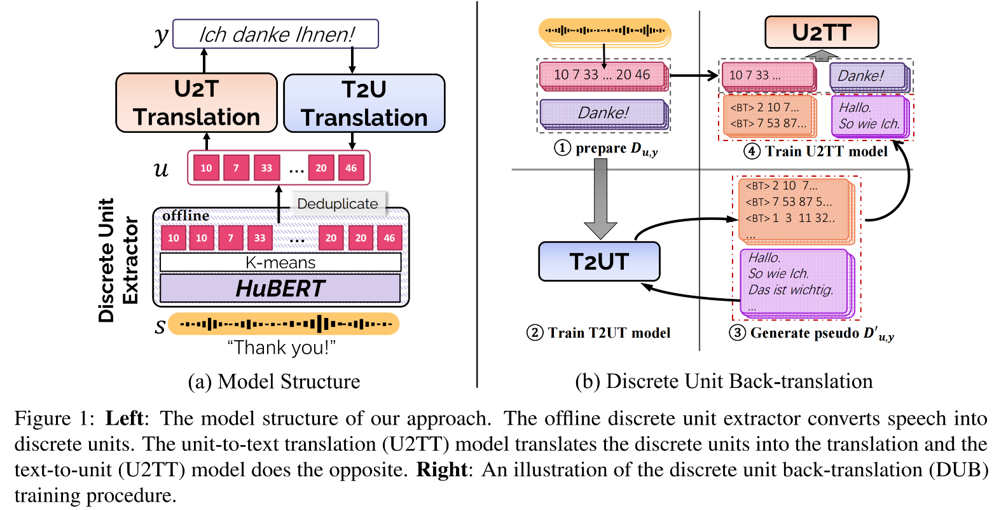

# DUB: Discrete Unit Back-translation for Speech Translation
This is a pytorch implementation of [DUB: Discrete Unit Back-translation for Speech Translation](https://export.arxiv.org/abs/2305.11411) (ACL 2023 Findings).

## Overview
Can speech be unsupervisedly discretized? Is it better to represent speech with discrete units than with continuous features in direct ST? How much benefit can useful MT techniques bring to ST? Discrete Unit Back-translation (DUB) migrates the useful back-translation and pre-training technique from machine translation to speech translation by discretizing the speech signals into unit sequences.  Experimental results show that DUB can further yield an average 5.5 BLEU gain on the MuST-C English-to-German, French, and Spanish translation directions. Experimental results on CoVoST-2 dataset shows that DUB is particularly beneficial for low-resource or unwritten languages in the world.
<div align="center">
  
</div>

## Download Trained Models
You can download all the models at [🤗huggingface model](https://huggingface.co/nutation/DUB).

| **Language** |                                           **Model**                                            |                                                                                           **SPM & Vocab**                                                                                            |
|:--------:|:----------------------------------------------------------------------------------------------|:----------------------------------------------------------------------------------------------------------------------------------------------------------------------------------------------------| 
| En-De    | •[U2TT](https://huggingface.co/nutation/DUB/resolve/main/en-de/u2tt.pt)<br> •[T2UT](https://huggingface.co/nutation/DUB/resolve/main/en-de/t2ut.pt)<br> •[U2TT_DUB](https://huggingface.co/nutation/DUB/resolve/main/en-de/u2tt_dub.pt)<br> •[Bimodal BART](https://huggingface.co/nutation/DUB/resolve/main/en-de/bimodal_bart.pt) | •[SPM model](https://huggingface.co/nutation/DUB/resolve/main/en-de/spm_units_de.model)<br> •[Vocab](https://huggingface.co/nutation/DUB/resolve/main/en-de/spm_units_de.txt) | 
| En-Es    | •[U2TT](https://huggingface.co/nutation/DUB/resolve/main/en-es/u2tt.pt)<br> •[T2UT](https://huggingface.co/nutation/DUB/resolve/main/en-es/t2ut.pt)<br> •[U2TT_DUB](https://huggingface.co/nutation/DUB/resolve/main/en-es/u2tt_dub.pt) | •[SPM model](https://huggingface.co/nutation/DUB/resolve/main/en-es/spm_units_es.model)<br> •[Vocab](https://huggingface.co/nutation/DUB/resolve/main/en-es/spm_units_es.txt) | 
| En-Fr    | •[U2TT](https://huggingface.co/nutation/DUB/resolve/main/en-fr/u2tt.pt)<br> •[T2UT](https://huggingface.co/nutation/DUB/resolve/main/en-fr/t2ut.pt)<br> •[U2TT_DUB](https://huggingface.co/nutation/DUB/resolve/main/en-fr/u2tt_dub.pt) | •[SPM model](https://huggingface.co/nutation/DUB/resolve/main/en-fr/spm_units_fr.model)<br> •[Vocab](https://huggingface.co/nutation/DUB/resolve/main/en-fr/spm_units_fr.txt) | 


## Running DUB on MuST-C En-De
### Installation
```bash
git clone git@github.com:0nutation/DUB.git
cd DUB
pip3 install -r requirements.txt
pip3 install --editable ./
```
### Data preparation
1. Environment setup
```bash
export ROOT="DUB"
export LANGUAGE="de"
export MUSTC_ROOT="${ROOT}/data-bin/MuSTC"
```

2. Download the [MuST-C v1.0](https://ict.fbk.eu/must-c/) archive `MUSTC_v1.0_en-de.tar.gz` and uncompress it:
```bash
mkdir -p ${MUSTC_ROOT}
cd $MUSTC_ROOT
tar -xzvf MUSTC_v1.0_en-${LANGUAGE}.tar.gz
```

3. Prepare units and text for training
```bash
bash ${ROOT}/src/prepare_data.sh ${LANGUAGE}
```

### Training
#### Train U2TT
Train unit-to-text translation(U2TT) forward-translation model.
```bash
bash entry.sh --task translate --src_lang en_units --tgt_lang ${LANGUAGE}
```

#### Train T2UT
Train text-to-unit translation(T2UT) back-translation model.
```bash
bash entry.sh --task translate --src_lang ${LANGUAGE} --tgt_lang en_units
```

#### Back-translate 
Generate pseudo pair data using pretrained T2UT model.
```bash
BT_STRATEGY="topk10"  #["beam5", "topk10", "topk300"]
bash ${ROOT}/src/back_translate.sh --real_lang ${LANGUAGE} --sys_lang en_units --ckpt_name checkpoint_best.pt --bt_strategy ${BT_STRATEGY}
```

#### Train U2TT on mix dataset
Train U2TT on mixture of real and pseudo pair data.
```bash
bash ${ROOT}/src/back_translate.sh --task translate --src_lang en_units --tgt_lang ${LANGUAGE} --bt_strategy ${BT_STRATEGY}
```

#### Train bimodal BART
Train bimodal BART. Before pre-training bimodal BART, you need to generate GigaSpeech units and save it to ${ROOT}/data-bin/RawDATA/bimodalBART/en_units-${LANGUAGE}/train.unit
```bash
bash entry.sh --task bimodalBART --src_lang en_units --tgt_lang ${LANGUAGE}
```

#### Trian U2TT from bimodal BART
Train U2TT with bimodal BART as pretrained model.
```bash
bash entry.sh --task translate --src_lang en_units --tgt_lang ${LANGUAGE} --bimodalBARTinit True
```

### Evaluation
```bash
export CKPT_PATH="path to your checkpoint"
bash ${ROOT}/src/evaluate.sh ${LANGUAGE} ${CKPT_PATH}
```

## Citation
If you find DUB useful for your research and applications, please cite using the BibTex:
```
@inproceedings{zhang2023dub,
	title = {DUB: Discrete Unit Back-translation for Speech Translation},
	author = {Dong Zhang and Rong Ye and Tom Ko and Mingxuan Wang and Yaqian Zhou},
	booktitle = {Findings of ACL},
	year = {2023},
}
```
